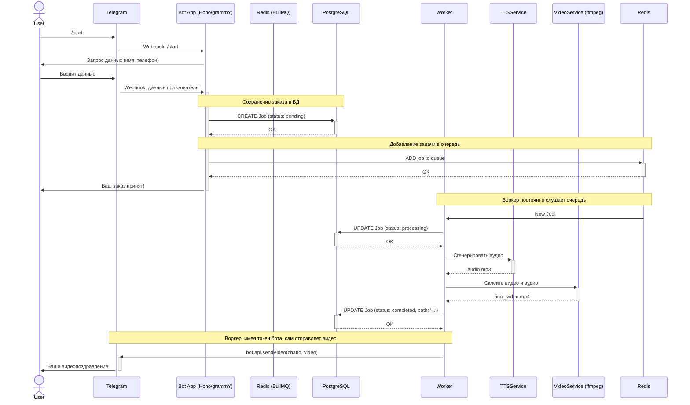

# Архитектура приложения "Новогодний Бот"

## 1. Обзор

Это документ, описывающий архитектуру Telegram-бота для генерации персонализированных новогодних видеопоздравлений. Система спроектирована как набор взаимодействующих сервисов, работающих в Docker-контейнерах, что обеспечивает модульность, масштабируемость и переносимость.

**Ключевые технологии:**
*   **Среда выполнения:** Node.js, TypeScript
*   **Веб-сервер и бот:** Hono, grammY
*   **База данных:** PostgreSQL с Prisma ORM
*   **Очередь задач:** Redis + BullMQ
*   **Развертывание:** Docker, Docker Compose

## 2. Компоненты системы

Система состоит из следующих логических и физических компонентов:

### 2.1. Bot App (Продюсер задач)
Основное приложение, с которым взаимодействует Telegram.

*   **Технологии:** Hono, grammY.
*   **Ответственность:**
    1.  Прием обновлений от Telegram через webhook.
    2.  Обработка команд и ведение диалога с пользователем для сбора данных (используя `grammy/conversations`).
    3.  Валидация полученных данных.
    4.  Сохранение информации о пользователе и заказе в базу данных **PostgreSQL** через **Prisma**.
    5.  Постановка новой задачи (job) в очередь **BullMQ** (которая хранится в **Redis**).
    6.  Отправка пользователю быстрых ответов ("Ваш заказ принят" и т.д.).
*   **Точка входа:** `src/main.ts`.

### 2.2. Worker (Потребитель задач)
Фоновый процесс, выполняющий "тяжелую" работу по генерации видео.

*   **Технологии:** Node.js, BullMQ, Prisma.
*   **Ответственность:**
    1.  Прослушивание очереди BullMQ на предмет появления новых задач.
    2.  Извлечение задачи из очереди и обновление ее статуса в БД на `processing`.
    3.  Вызов **`TTSService`** для генерации аудиофайла с обращением.
    4.  Вызов **`VideoService`** для наложения сгенерированного аудио на основное видео с помощью `ffmpeg`.
    5.  Сохранение пути к готовому видео и обновление статуса задачи в БД на `completed`.
    6.  Инициация отправки готового видео пользователю (см. раздел "Взаимодействие").
*   **Точка входа:** `src/worker.ts` (будет создан).

### 2.3. Слой сервисов (Services)
Логический слой, инкапсулирующий бизнес-логику и взаимодействие с внешними инструментами.

*   **`QueueService`:** Абстракция над BullMQ для добавления задач в очередь.
*   **`DatabaseService`:** Абстракция над Prisma для всех операций с базой данных.
*   **`TTSService`:** Сервис для работы с API синтеза речи.
*   **`VideoService`:** Сервис-обертка над `ffmpeg` для выполнения операций с видео.

### 2.4. Внешние зависимости
*   **PostgreSQL:** Реляционная база данных для персистентного хранения всех данных о заказах. Является "единственным источником правды" (single source of truth) о статусе задач.
*   **Redis:** In-memory хранилище, используемое как бэкенд для BullMQ.

## 3. Схема взаимодействия компонентов

Диаграмма ниже иллюстрирует полный цикл от запроса пользователя до получения готового видео.



**Важное архитектурное решение:** Чтобы не усложнять `Bot App` логикой проверки готовности видео, **Worker** после успешной генерации сам будет отправлять видео пользователю. Для этого ему потребуется токен бота, который будет передан через переменные окружения.

## 4. Инфраструктура и Docker

Для обеспечения переносимости и простоты локальной разработки вся система будет упакована в Docker-контейнеры и управляться через `docker-compose.yml`.

*   **`docker-compose.yml`** будет определять следующие сервисы:
    *   `bot-app`: Контейнер с основным Node.js приложением.
    *   `worker`: Контейнер с фоновым обработчиком задач.
    *   `postgres`: Контейнер с базой данных PostgreSQL.
    *   `redis`: Контейнер с сервером Redis.
    *   `bull-board` (опционально): Контейнер с веб-интерфейсом для мониторинга очередей BullMQ.

Это позволит запустить все приложение одной командой `docker-compose up`.

**Локальная разработка и `ngrok`:** Для того чтобы Telegram мог отправлять вебхуки на локально запущенный `bot-app`, необходимо использовать туннелирующий сервис, такой как `ngrok`. Он создает публичный URL, который перенаправляет запросы на ваш локальный порт, делая вашу машину доступной для API Telegram.

## 5. Предлагаемая структура директорий

Для реализации описанной архитектуры предлагается следующая структура папок в `src/`:

```
src/
├── bot/              # Логика бота grammY (features, keyboards, etc.)
├── server/           # Логика веб-сервера Hono
├── queue/            # Настройка очередей BullMQ и воркеров
│   ├── definitions/  # Определение очередей
│   └── processors/   # Логика обработки задач
├── services/         # Переиспользуемые сервисы (TTS, Video, etc.)
├── db/               # Схема Prisma и утилиты для работы с БД
├── types/            # Общие типы и интерфейсы TypeScript
├── config.ts         # Конфигурация приложения
├── logger.ts         # Логгер
├── main.ts           # Точка входа для Bot App
└── worker.ts         # Точка входа для Worker
```
